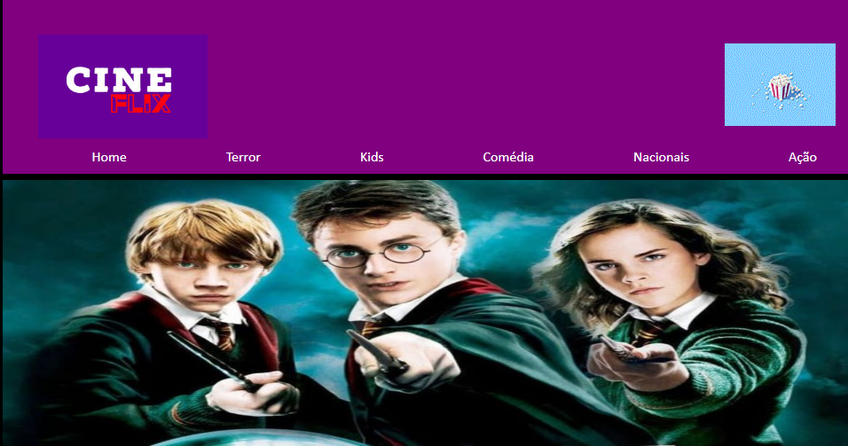

<h1 align="center">Cineflix</h1>

## 💻 Project
This repository contains a project done in the web classes.

## 🔑 Why
 This project is part of my personal study portfolio, so, I'll be happy if you could provide me any feedback about the project, code, structure or anything that you can report that could make me a better developer! 

## ✨ Technologies and tools
- [VSCODE](https://code.visualstudio.com/)

## 📄License
This project is licensed under the MIT License - see the [LICENSE.md](LICENSE.md) file for details.
 
Thank you!

 
 
